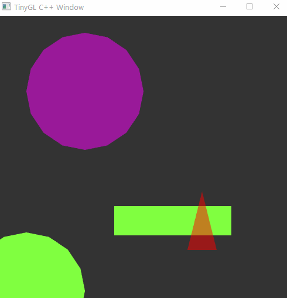

# tinygl-cpp

Single header, cross-platform openGL framework for drawing 2D squares, circles, and triangles.

[](https://github.com/alinen/agl/actions/workflows/cmake.yml)
[](https://github.com/alinen/agl/actions/workflows/cmake-windows.yml)
[](https://github.com/alinen/agl/actions/workflows/cmake-linux.yml)

This is a smaller, more lightweight version of my [AGL](https://github.com/alinen/agl) API, which supports a variety of graphics demos. This project supports 
drawing circles, squares, and triangles using an orthographic projection based on the initial window size. User mouse and keyboard input is also supported.

Here is a code example with corresponding output

```
#include "tinygl-cpp.h"

using namespace tinygl;
class MyWindow : public Window {
  public:
    MyWindow(int w, int h) : Window(w, h) {}

    void setup() override {
      std::cout << "Window size: " << width() << ", " << height() << std::endl;
    }

    void draw() override {
      background(0.2f, 0.2f, 0.2f); // parameters: r, g, b

      color(0.5, 1.0, 0.25);   // parameters: r, g, b
      circle(50, 30, 100); // parameters: x, y, radius
      circle(50, 30, 100); // parameters: x, y, radius
      square(300, 150, 200, 50); // parameters: x, y, width, height

      color(1, 0, 0, 0.5);
      triangle(350, 150, 50, 100);

      color(1, 0, 1, 0.5);
      ellipsoid(150, 350+25*sin(elapsedTime()), 100, 100);
    }
};

int main() {
  MyWindow window(500, 500);
  window.run();
}
```



# Documentation

All functionality is implemented in the class [Window](https://github.com/alinen/tinygl-cpp/blob/main/tinygl-cpp.h). Just include the header file to use it.

# Building

This project relies on [OpenGL 4.0](https://www.khronos.org/registry/OpenGL-Refpages/gl4/), [GLEW](http://glew.sourceforge.net/), and [GLFW](https://www.glfw.org/) builds using CMake. 

**Windows**

Using [Visual Studio Community 2019](https://visualstudio.microsoft.com/vs/community/), you can generate the build files from the `Git bash` terminal.

```
$ git clone <this repository>
$ cd tinygl-cpp
$ mkdir build
$ cd build
$ cmake ..
$ start tinygl-cpp.sln
```

The final command opens visual studio, where you can build and run the same program. The dependencies (GLEW and GLFW) are included in this repository.

**MacOS**

On macOS, you should have git and a C++ compiler from running `command xcode-select --install`. To install cmake, glew, and glfw, you can use brew.

* `brew install glew`
* `brew install glfw3`

To build, open terminal and execute

```
$ git clone <this repository>
$ cd tinygl-cpp
$ mkdir build
$ cd build
$ cmake ..
$ make
$ ./tinygl-example
```

**Ubuntu**

On Ubuntu, you will need to install openGL, glew and glfw.

* `sudo apt-get install libglew-dev`
* `sudo apt-get install mesa-utils`
* `sudo apt-get install libglfw3-dev`

To build, open terminal and execute

```
$ git clone <this repository>
$ cd tinygl-cpp
$ mkdir build
$ cd build
$ cmake ..
$ make
$ ./tinygl-example
```
